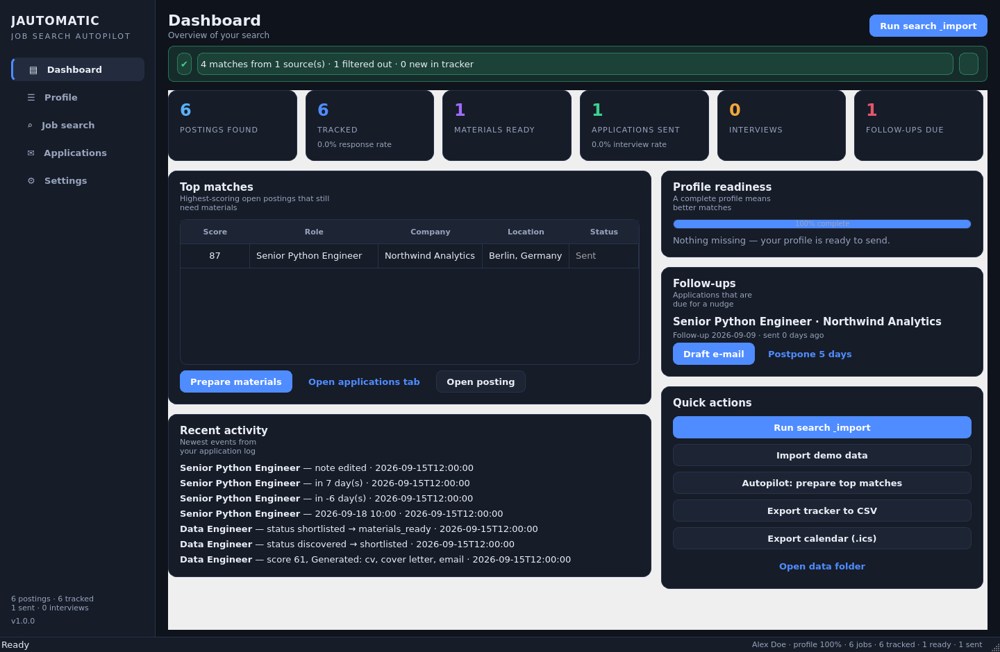
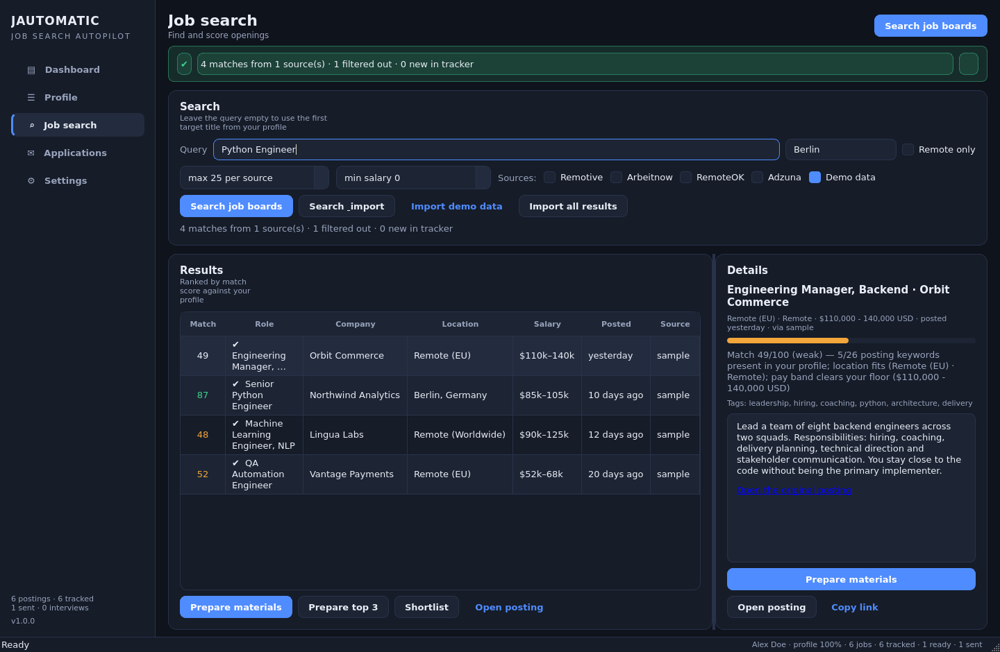
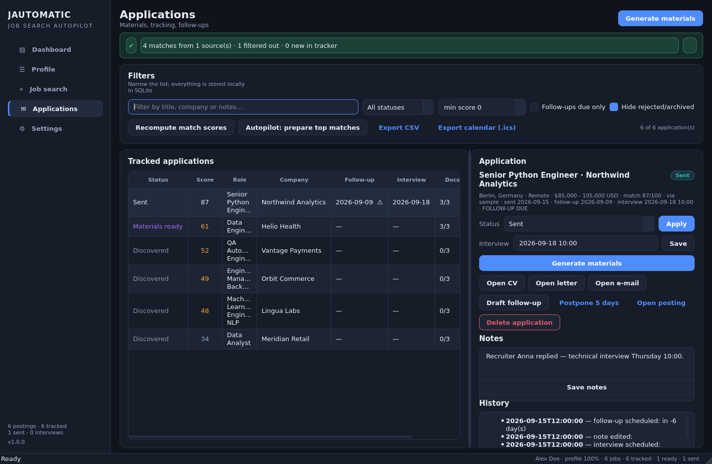
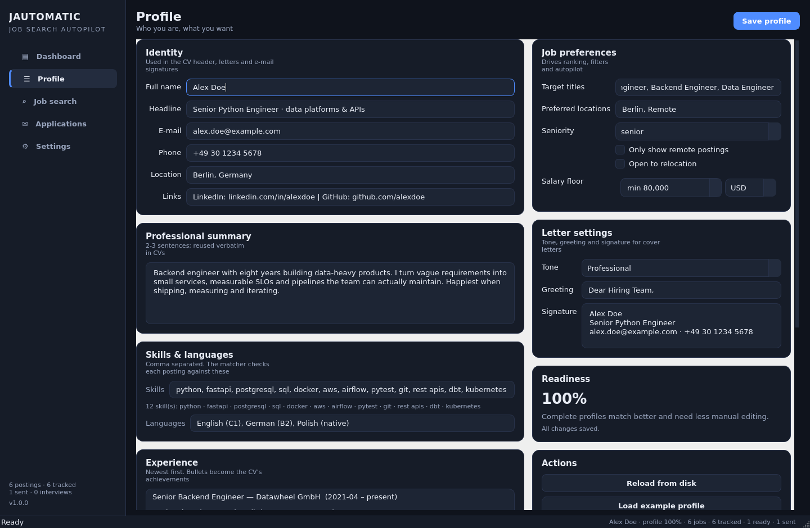
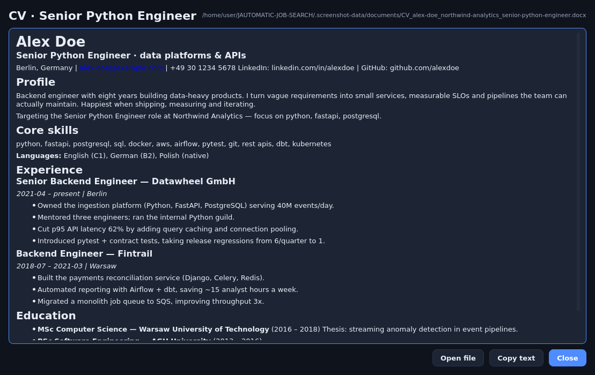
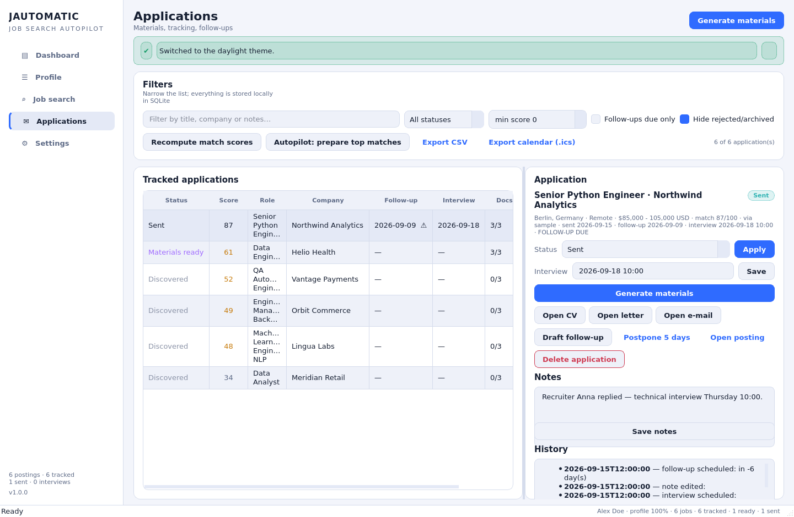

# JAUTOMATIC JOB SEARCH

A local-first desktop job-search autopilot. It pulls postings from public job boards,
scores every one against **your** profile, then writes a tailored CV, cover letter and
application e-mail for whichever roles you pick — and keeps track of what you sent, when
to follow up and how the search is going.

No accounts, no cloud, no telemetry: your profile, documents and database live in plain
files on your machine.

```
┌────────────┐   ┌───────────────┐   ┌──────────────────┐   ┌───────────────────┐
│ job boards │ → │ match & rank  │ → │ CV / letter /    │ → │ tracker, follow-  │
│ (4 sources)│   │ (0-100 score) │   │ e-mail generator │   │ ups, CSV + .ics   │
└────────────┘   └───────────────┘   └──────────────────┘   └───────────────────┘
```

## Feature tour

**Dashboard** — postings found, tracked applications, materials ready, applications sent,
interviews and follow-ups that are due; top matches; profile-readiness checklist; a live
activity log; quick actions (search, demo import, autopilot, CSV export, calendar export).

**Profile** — identity, headline, summary, skills, languages, work experience (with
achievement bullets), education, target titles/locations, salary floor, remote-only and
relocation switches, plus letter tone/greeting/signature. Ships with a realistic example
profile to explore the app before filling in your own data.

**Job search** — query + location + remote/min-salary filters, per-source result limits,
exclude keywords. Results are de-duplicated across boards, ranked by match score and shown
with the reasons behind each score ("pay band clears your floor", "title matches your target
role", …). One click generates the whole application pack.

**Applications** — a real tracker: status pipeline (discovered → shortlisted → materials
ready → sent → interview → offer, plus rejected/archived), score, documents 3/3 indicator,
follow-up date with a due warning, an interview date/time field, notes, and a full event
history per application.

**Settings** — enable/disable sources, Adzuna credentials, search defaults, document
options (template, format, letter/e-mail toggles), autopilot thresholds, follow-up window,
dark/light theme, and data tools (open folder, backup, CSV export, calendar export, clear
cache).

**Autopilot (opt-in)** — after an import, generate materials automatically for postings
above your score threshold, up to a per-run limit.

**Follow-up reminders** — marking an application as *sent* schedules a follow-up (default 7
days). When it comes due it shows up on the dashboard with a one-click politely-worded
follow-up e-mail; reminders can be postponed.

**Calendar export (.ics)** — interviews and follow-ups become RFC 5545 calendar events you
can drop into Google Calendar, Outlook or Apple Calendar. Interviews carry the date/time
you enter in the tracker (all-day when you only give a day, timed otherwise, defaulting to
one hour); follow-ups become all-day events on their due date. UIDs are stable, so
re-importing a fresh export updates events instead of duplicating them. Available from the
Applications tab, the dashboard quick actions and Settings → Data.

**Assisted application-form autofill** — point `tools/autofill.py` at an application form
(Greenhouse / Lever / Workday / plain HTML5 shapes) and it plans which of your profile
values go into which fields, then types them into a real browser for you to review:
identity, contact details, links, salary expectation, years of experience, the CV from
your application pack, yes/no eligibility questions you have answered, and custom
answers you keep in `profile.json` under `extra.autofill`. Ambiguous or unanswered
fields are listed for you, EEO/disclosure questions are left alone, and password fields
are never touched. The tool deliberately stops there: **you** log in (a persistent
browser profile keeps you signed in) and **you** press Submit — automated login and
auto-submission are the terms-of-service-breaching, account-banning kind of automation
and are out of scope by design.

| | |
|---|---|
|  |  |
|  |  |
|  |  |

## Install & run

```bash
git clone https://github.com/eugenshila/JAUTOMATIC-JOB-SEARCH.git
cd JAUTOMATIC-JOB-SEARCH

python3 -m venv .venv
.venv/bin/pip install -r requirements.txt      # Windows: .venv\Scripts\pip install -r requirements.txt
.venv/bin/python main.py                       # Windows: .venv\Scripts\python main.py
```

Dependencies: **PySide6** (interface), **requests** (job boards), **python-docx** (Word
export). Python 3.10+.

### Command line

`main.py` is also a small CLI, handy for cron jobs or quick checks:

```bash
python main.py --selftest                  # head-less smoke test: models → scraper → docs → export
python main.py --scrape "data engineer"    # print ranked matches, no GUI
python main.py --scrape "python" --offline --limit 10   # demo data only, no network
python main.py --data-dir ./data           # portable, self-contained data directory
```

The assisted autofill driver is a separate tool (the browser half needs the optional
`playwright` dependency; the planning half is pure stdlib):

```bash
python tools/autofill.py --form tests/fixtures/forms/greenhouse.html --plan  # offline plan
python tools/autofill.py --url https://boards.greenhouse.io/acme/jobs/123    # assisted fill
python tools/autofill.py --url … --application <id>   # attach that application's CV/letter
pip install playwright && playwright install chromium # one-off, enables --url
```

## Where your data lives

By default in your user data folder (`%APPDATA%\JAUTOMATIC` on Windows,
`~/.local/share/jautomatic-job-search` on Linux/macOS), overridable with `--data-dir` or
`JAUTOMATIC_DATA_DIR`:

```
profile.json          your details (also editable by hand / exportable / importable)
settings.json         sources, defaults, theme
jautomatic.sqlite3    postings + applications (SQLite, WAL)
documents/            generated CVs, cover letters, e-mail drafts, follow-ups
exports/              CSV tracker exports + .ics calendar exports
```

Deleting the folder is a full reset — there is nothing hidden elsewhere.

## How matching works

Every posting gets a 0-100 score, and the UI always shows *why*:

| Weight | Signal | Notes |
|-------:|--------|-------|
| 55 | Keyword coverage | posting tags/skills vs. your skills, experience, education, summary; tag hits count double |
| 20 | Title alignment | overlap with your target titles (falls back to your headline) |
| 10 | Location / remote | remote-friendly postings and your preferred locations score highest |
| 10 | Salary | your floor vs. the advertised band (undisclosed bands score neutrally) |
| 5  | Freshness | ≤3 days old is full marks, then it decays |

The score drives ranking, the autopilot threshold, and which strengths the cover letter and
e-mail highlight (missing keywords are never invented — the generators only re-use what your
profile actually contains).

## Job sources

| Source | Key needed | Notes |
|--------|-----------|-------|
| [Remotive](https://remotive.com) | no | remote roles, searchable JSON API |
| [Arbeitnow](https://www.arbeitnow.com) | no | European board, JSON API |
| [RemoteOK](https://remoteok.com) | no | remote-first board, JSON API |
| [Adzuna](https://developer.adzuna.com) | free app id + key | aggregated listings, country selectable |
| Demo data | no | offline sample postings so the app is always usable |

Sources are queried in parallel; a failing board is reported in the results line ("issues:
Remotive: timed out") and never blocks the others. If *no* board can be reached, the app
offers clearly-labelled demo postings so the workflow can still be explored.

Adding a board = subclass `JobSource` in `jautomatic/services/job_scraper.py` (set `name`,
`label`, implement `fetch()`), then register it in `default_sources()`.

## Generated documents

* **CV** — three templates: `modern` (impact-first, tailored skills line), `classic`
  (traditional ATS layout) and `compact` (one page). Export as `.docx`, `.md` or `.txt`.
* **Cover letter** — assembled deterministically from your profile, the posting text and the
  match analysis, in one of four tones (`professional`, `friendly`, `enthusiastic`,
  `concise`). It quotes the posting, translates your achievements into first person ("Owned
  the platform…" → "I owned the platform…"), and talks about salary only when a band was
  advertised.
* **Application e-mail** — subject line, recipient (when the posting lists a contact address)
  and an attachment list matching the files that were generated.
* **Follow-up e-mail** — short, polite nudge with the days-since-sent baked in.

Generated files are named after you, the company and the role, e.g.
`CV_alex-doe_northwind-analytics_senior-python-engineer.docx`, so a folder full of them stays
sortable.

## Project layout

```
main.py                              entry point (GUI + --selftest / --scrape)
jautomatic/
  models.py                          dataclasses, scoring helpers, SQLite/JSON workspace
  services/
    job_scraper.py                   sources, query filtering, de-dup, offline fallback
    application_pipeline.py          matching, ranking, tracking, autopilot, CSV export
    calendar_export.py               RFC 5545 .ics export (interviews + follow-ups)
    autofill.py                      deterministic form parser, taxonomy, fill planner
    autofill_browser.py              assisted Playwright hand-off (optional dependency)
    cv_generator.py                  templates + docx/md/txt exporters
    cover_letter.py                  tone-driven letter drafting
    email_drafter.py                 application + follow-up e-mails
  ui/
    main_window.py                   window shell, background workers, app state
    theme.py                         dark/light palettes, shared widgets
    dashboard_tab.py  profile_tab.py  job_search_tab.py  applications_tab.py  settings_tab.py
tests/                               stdlib unittest suite (146 tests, no network)
tests/fixtures/forms/                committed ATS form fixtures for the autofill engine
tools/screenshot.py                  head-less UI driver used for the screenshots above
tools/autofill.py                   autofill CLI (--plan offline, --url assisted)
tools/genstubs.py                    stub libs so PySide6 runs in headless/CI containers
```

## Development

```bash
.venv/bin/python -m unittest discover -s tests -t .   # 146 tests, no network needed
.venv/bin/ruff check jautomatic main.py tools tests   # lint
.venv/bin/python main.py --selftest                   # end-to-end smoke test
```

The scraping tests run against realistic canned payloads of every board, so the suite needs
no network. `tests/fixtures.py` holds those payloads — update them when a board changes
shape.

The autofill engine is tested the same way: `tests/fixtures/forms/` holds committed HTML
captures of Greenhouse / Lever / Workday / generic application-form shapes, and
`tests/test_autofill.py` checks the fill plan they produce (what fills, what is flagged for
review, what is left alone). The only untested seam is the Playwright hand-off in
`autofill_browser.py` — you can exercise everything else offline:

```bash
.venv/bin/python tools/autofill.py --form tests/fixtures/forms/greenhouse.html --plan
```

`tools/screenshot.py` additionally drives the real UI offscreen end-to-end (seeds demo data,
runs the search tab through its worker, prepares documents, opens a preview, checks the
follow-up reminder) and writes the PNGs used above — a useful regression check after UI
changes. Renders are byte-reproducible: the driver uses a fixed data directory (wiped on
start) and a frozen clock, so two runs produce identical PNGs — `sha256sum` them to verify.

Headless/CI note: PySide6 links against `libGL`, `libEGL`, `libxkbcommon` and `libdbus-1`,
which slim containers often lack (and you cannot `apt-get install` without root). Build
no-op stubs once and run the UI offscreen:

```bash
python tools/genstubs.py .stublibs
LD_LIBRARY_PATH=.stublibs QT_QPA_PLATFORM=offscreen python tools/screenshot.py
```

## Privacy

Everything runs locally. The only outbound requests are the job-board queries you trigger
(and, when a posting is opened, your browser). Credentials for Adzuna are stored in
`settings.json` in plain text — treat that file like any other config file.

## Ideas for next steps

* ~~Real job-board scrapers with login (LinkedIn/Indeed) and application-form autofill~~ —
  *autofill is done* (assisted scope, see above). Logged-in scraping of LinkedIn/Indeed
  remains deliberately unbuilt: automated login breaches their terms of service and gets
  accounts banned, so unless someone deliberately accepts that risk, public boards remain
  the way in.
* More CV templates / user-supplied template files
* Interview-prep notes and question banks per application
* ~~Calendar (ICS) export for interviews and follow-ups~~ — done
* Installer packaging (MSI/PyInstaller) — intentionally not part of this repository yet
